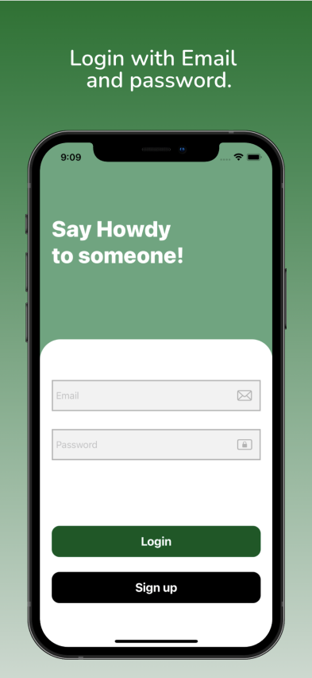

# Message-app

This is a real time IOS messaging app wrote in Swift 5. The app uses Firebase Auth to authenticate and register users and Firebase Realtime database to manage real time messaging.

## Features

- Real Time Conversations.
- User log in/out and registration using firebase Auth.
- Search for Users.
- Deleting Conversations.
- User Profile.

## Screenshots

